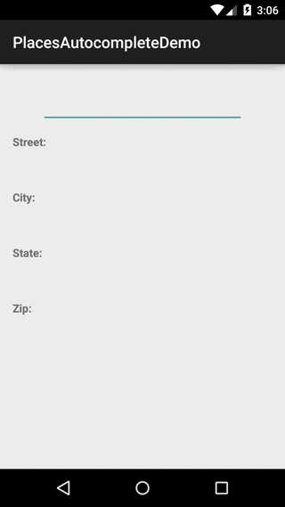

# android-placesautocompletetextview

[](https://magnum.travis-ci.com/seatgeek/android-placesautocompletetextview)

An AutocompleteTextView that interacts with the [Google Maps Places API](http://mapsplacesapidocs.com) to provide
location results and caches selected results in a history file for later use



### Installing

The `PlacesAutocompleteTextView` is available from the sonatype snapshots repository.
Use the following in your `build.gradle`:

```groovy
repositories {
    maven { url 'https://oss.sonatype.org/content/repositories/snapshots' }
}

dependencies {
    compile 'com.seatgeek:placesautocomplete:0.1-SNAPSHOT'
}
```

### Basic setup and usage

1. You'll need a Google API key for you application. There are instructions on how to set up your API's project and generate a key [here](http://todo.com)
2. You application will need the `android.permission.INTERNET` permission in its manifest for the View to interact with the Google Maps API
3. Once you have your key, you're ready to add the `PlacesAutocompleteTextView` to your layout xml:

    ```xml
            <com.seatgeek.placesautocomplete.PlacesAutocompleteTextView
       android:id="@+id/places_autocomplete"
       android:layout_width="match_parent"
       android:layout_height="wrap_content"
       app:pacv_googleMapsApiKey="<YOUR_GOOGLE_API_KEY>"/>
    ```
4. Finally, you'll likely want a listener in your UI to know when the user has selected an item from the dropdown:

    ```java
            placesAutocomplete.setOnPlaceSelectedListener(
           new OnPlaceSelectedListener() {
               @Override
               public void onPlaceSelected(final Place place) {
                  // do something awesome with the selected place
               }
           }
   );
    ```
5. That's it!

_Note: you can treat the `PlacesAutocompleteTextView` the same as any `AutocompleteTextView`
as it extends from the framework `AutocompleteTextView`. This means you can use
custom styles with all the standard view properties._

### Advanced usage/customization

#### XML properties

There are a number of different parameters that you can pass through to the Google
Maps Places API to get various results:

xml property | java method | description
--- | --- | ---
 `pacv_historyFile` | `setHistoryManager()` | By default, the `PlacesAutocompleteTextView` will save the history of the selected `Place`'s in a file on the file system. This is great for cases when your user may be typing in the same address in different parts of your UI or across different sessions. If you'd like to simply change the location of the file on the filesystem, you can specify the path string here. By default, the file is stored in the application cache dir under `autocomplete/pacv_history.json`. If this is a feature that you'd like to disable, you can set the property in xml to `@null` or call `setHistoryManager(null)`.
`pacv_resultType` | `setResultType()` | The Places API can return various types of `Place`s depending on what your application is looking to allow the user to select. By default, the `PlacesAutocompleteTextView` only requests items of type `address`, which returns locations associated with a full postal address, public or residential. You can change this to also be `geocode` for blah or `establishment` for non-resitential locations
`pacv_adapterClass` | `setAdapter()` | If you don't like the default `Adapter` for displaying the items in the dropdown list (it is pretty basic by default), you can override it by specifying your own in xml (by passing the fully-qualified classname) or using `setAdapter()`. An important note: because of how the filtering functionality works in the `PlacesAutocompleteTextView`, your custom adapter must extend `AbstractPlacesAutocompleteAdapter`.

#### Need more details? `PlaceDetails`

```
// TODO: Place Detail API
```

#### Getting stylish

```
// TODO: Custom styling of things
```

### Contributing

0. Fork this repo and clone your fork
0. Make your desired changes
0. Add tests for your new feature and ensure all tests are passing
0. Commit and push
0. Submit a Pull Request through Github's interface and a project maintainer will
decide your change's fate.

_Note: issues can be submitted via [github issues](https://github.com/seatgeek/android-placesautocompletetextview/issues/new)_

### License

PlacesAutocompleteTextView is released under a [BSD 2-Clause License](http://opensource.org/licenses/BSD-2-Clause), viewable [here](LICENSE.txt)
